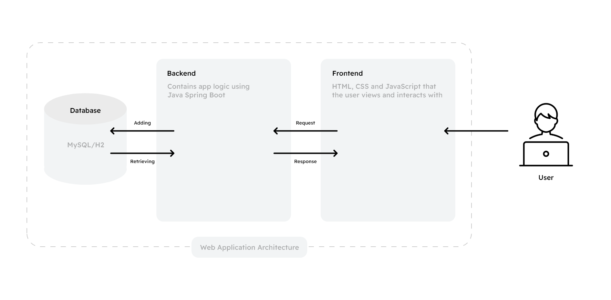
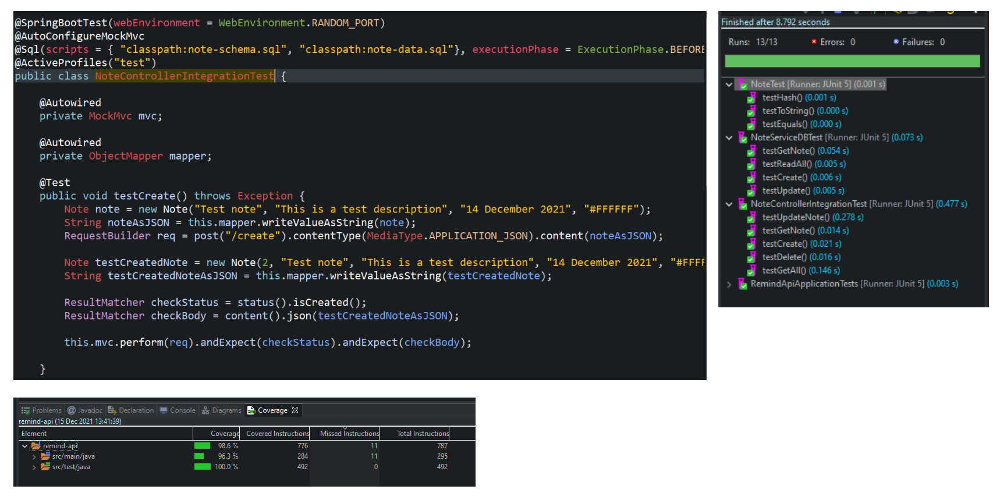
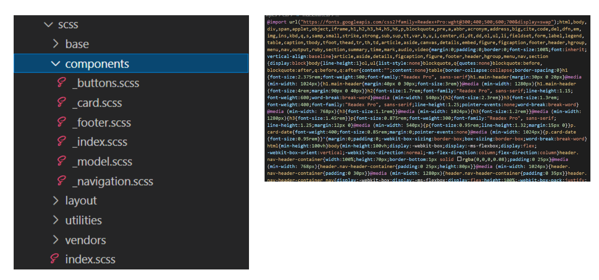

# Full Stack CRUD Web Based Note Taking App

## Nick Cave

- Test coverage: **96.3%**
- [Presentation Link](https://google.co.uk)
- [Sprint Board](https://google.co.uk)

---

## Introduction

We were tasked to build a web application that encompasses all of the main technologies that we have been taught during our training. The covers things such as:

- Project management: The creation of a Jira board with each task/feature split up into User Stories which each had sub tasks assigned to them. We also implemented things like a version control system that used the feature branch model.
- Java Spring Boot: This was used to be able to create a fully functional API with CRUD capabilities that connected with a MySQL database to allow for persistence.
- Testing: Using Unit Testing and Integration Testing with MockMvc and Mockito. Selenium was planned for the front-end but we ran out of time to learn this.
- Front-end: The use of HTML,CSS and JavaScript to create a fully interactable front-end for the project that had API integration to talk with the backend.

---

## Project Management

At the beginning of the project, I made sure to thoroughly review the specification document that was given to us. To ensure that I fully understand the brief and what is required of me during this project, from there I created a brand new Jira board and began splitting up tasks into User Stories.

Each user story was then assigned multiple sub tasks, which each covered small but vital features that needed to be implemented into the project. Each sub task was given a story point estimate and a priority rating, plus assigned to a developer (me).

With each subtask of a user story, I created a feature branch off of the dev branch in my version control system Git, after finishing each feature it was pushed up to Github and a pull request was made to merge the new changes into dev.

---

## Backend

The backend of the project was built using the popular framework called Spring Boot for Java, it’s widely used to create REST API’s but has many other functions as well. I used Spring to create an API that communicated with a database to allow for CRUD functionality, below is a diagram that gives you an impression of the architecture for the web application.

---

## Testing

During the testing phase of the application, both integration and unit testing were used.

I used MockMvc for the integration testing which allowed me to create a mocked version of my controller class. From there I was able to create mock HTTP requests to each endpoint within my project, I could then curate my test to each endpoint to ensure that they were working as intended.

Mockito was then using for the unit testing, this allowed me test specific parts of my program, I mocked responses that would be returned by the repo class, that way I could test to see what is returned is equal to the test data.

---

## Front-end

The front-end of the project is where a majority of the code is located, I built it all using HTML, CSS/SCSS and JavaScript. I did plan to implement React for the front-end but decided against this due to time constraints.

Before writing any code of styling, I designed what I wanted the front-end to look like using Adobe XD, which featured different responive window designs too.

For the styling, we had a choice to use Bootstrap, but as I have a background in front-end development I decided against this and went for the custom built route, as I prefer having full control over everything.

I decided to use SCSS when writing the styling, as I am most comfortable with this and it includes many features that CSS does not (nested styling, functions, loops etc), after every save, the SCSS is compiled in CSS and minified to save on space (not really needed in this situation though). I followed the 7-in-1 rule for the structure of my SCSS files which allowed for a more tidy folder structure and easy to locate certain stylesheets.

The JavaScript was vanilla, with the help of Axios to make the HTTP requests to my API. I also used JS modules to help me separate my code out and keep things generally a lot tidier.

---

## Finished Site

